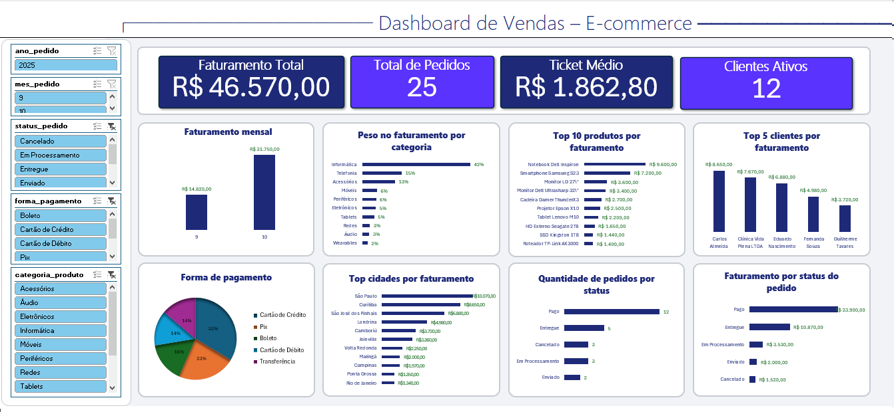

# Dashboard de Vendas – E-commerce (Excel)

Projeto desenvolvido como parte do **Bootcamp Klabin – Excel e Power BI Dashboards**, focado na criação de um dashboard de vendas para um e-commerce de eletrônicos usando apenas Excel Desktop (com Tabelas Dinâmicas e segmentações). O objetivo é ter uma visão executiva simples e interativa, sem depender de scripts SQL ou conexão externa: todos os dados necessários já estão dentro do arquivo `.xlsx`.

## Visão geral do dashboard

O painel apresenta:

- **KPIs principais**: Faturamento Total, Total de Pedidos, Ticket Médio e Clientes Ativos.  
- **Análises de vendas**: faturamento mensal e peso do faturamento por categoria.  
- **Rankings**: Top 10 produtos por faturamento e Top 5 clientes.  
- **Formas de pagamento e regiões**: participação de cada forma de pagamento no faturamento e top cidades por faturamento.  
- **Status dos pedidos**: quantidade de pedidos por status e faturamento por status do pedido.  

Todos os gráficos e cartões são controlados por segmentações de dados (ano, mês, status do pedido, forma de pagamento e categoria de produto), permitindo filtrar rapidamente o cenário desejado.

## Arquivo do projeto

O dashboard está disponível no arquivo Excel:

- 📄 **[Download do dashboard em Excel](excel/dashboard_vendas_ecommerce.xlsx)**

Basta abrir o arquivo no **Excel Desktop**, habilitar o conteúdo se solicitado e utilizar as segmentações para explorar as vendas do e-commerce de eletrônicos.
